# Shopro AI 能力全景、能力需求与提示词策略

> **文档定位**：本文件是 Shopro 项目 AI 能力的**唯一事实清单（Single Source of Truth）**，基于源码实测 + 供应商官方价目核查生成，用于指导模型选型、成本测算与提示词工程迭代。
> **核查方式**：逐文件读取 `supabase/functions/**`、`mcp/**`、`src/lib/sse.ts`，并核对 DeepSeek / 火山引擎 / 阶跃星辰 / SiliconFlow 官方定价页。
> **生成日期**：2026-09-26
> **汇率基准**：1 USD ≈ 7.1 CNY

---

## 〇、结论摘要

| 判断 | 内容 |
|---|---|
| **已接入模态** | 文本（LLM）、语音（TTS/ASR）、视频（文生视频/图生视频）、图像（封面生成）四类 |
| **真实接入的模型** | 仅 **6 个**真实可用：`DeepSeek-V4-Flash`、`doubao-seedance-2-0-fast-260128`、`FunAudioLLM/CosyVoice2-0.5B`、`stepaudio-2.5-tts`、`stepaudio-2.5-asr`、`sora-2` / `kling`（备选） |
| **文档宣称 vs 实际** | 文档宣称 7 大视频模型（含 happyhorse / Krea / wan2.7 / Luma / pixverse），**其中 5 个在前端为随机 Mock 视频，无真实 API 调用** |
| **最大能力缺口** | ① **无真实视频理解（VLM）能力**——竞品风格复刻靠 LLM 幻觉；② **无口型对齐（lip-sync）专用模型**；③ **Embedding 未真实接入**，RAG 为占位 |
| **成本风险** | 视频模态占单条视频成本的 **>90%**；`generate_video` 定价 50 积分 ≈ ¥15，对照 Seedance 2.0-fast 720p/5s 成本 ¥3.5，毛利约 77%，但**若切换到 Sora 2 1080p（¥10.6/5s）毛利将跌破 30%** |
| **需立即处置** | 3 个真实密钥明文入库（`key.txt` ×3 关联 AI 服务）；`deepseek-v4-pro` / `stepaudio` 两个 AI 函数**无 JWT 校验**，可被匿名刷取 |

---

## 一、AI 能力全景图（架构图）

```mermaid
graph TB
    %% ===== 样式 =====
    classDef input fill:#EFF6FF,stroke:#3B82F6,stroke-width:1.5px,color:#1E3A8A;
    classDef text fill:#F5F3FF,stroke:#8B5CF6,stroke-width:1.5px,color:#4C1D95;
    classDef audio fill:#ECFDF5,stroke:#10B981,stroke-width:1.5px,color:#064E3B;
    classDef vision fill:#FFF7ED,stroke:#F97316,stroke-width:1.5px,color:#7C2D12;
    classDef engine fill:#EEF2FF,stroke:#6366F1,stroke-width:2px,color:#1E1B4B;
    classDef model fill:#FEF2F2,stroke:#EF4444,stroke-width:2px,color:#7F1D1D;
    classDef output fill:#F0FDF4,stroke:#22C55E,stroke-width:2.5px,color:#14532D;
    classDef gap fill:#FEFCE8,stroke:#EAB308,stroke-width:1.5px,stroke-dasharray:4 3,color:#713F12;

    %% ===== 输入层 =====
    subgraph L1["📥 输入层 · 商家侧原始素材"]
        I1["商品详情页 URL / 分享口令"]:::input
        I2["商品文字描述 / 图片"]:::input
        I3["竞品爆款视频链接"]:::input
        I4["商家录音（语音输入）"]:::input
        I5["商品主图 / 素材库视频"]:::input
    end

    %% ===== 编排层 =====
    subgraph L2["⚙️ 编排层 · Deno Edge Functions（17 个）"]
        E_AI["ai-assistant<br/>统一 AI 网关 · 18 action<br/>限流 / 缓存 / 扣费 / 台账"]:::engine
        E_DS["deepseek-v4-pro<br/>文本直连代理"]:::engine
        E_AU["siliconflow-audio<br/>CosyVoice2 TTS 代理"]:::engine
        E_ST["stepaudio<br/>StepAudio TTS + ASR"]:::engine
        E_VD["seedance<br/>视频提交 / 查询"]:::engine
        E_K["kling / sora<br/>备选视频通道"]:::engine
        E_P3["phase3-assistant<br/>竞品 / 直播高光 / 发布"]:::engine
    end

    %% ===== 文本模态 =====
    subgraph L3["✍️ 文本与策划模态"]
        T1["URL 卖点智能提取<br/>extract_url_selling_points"]:::text
        T2["商品卖点生成<br/>generate_selling_points"]:::text
        T3["四层 CoT 流式脚本<br/>generate_script_four_layer"]:::text
        T4["台词情绪 NLP 分析<br/>emotion_analysis"]:::text
        T5["多语种脚本翻译<br/>translate_script"]:::text
        T6["视频 Prompt 优化<br/>optimize_prompt"]:::text
        T7["竞品风格解构<br/>analyze_style / _deep"]:::text
    end

    %% ===== 语音模态 =====
    subgraph L4["🎵 语音模态"]
        A1["情感化多语种配音 TTS<br/>stepaudio-2.5-tts / CosyVoice2"]:::audio
        A2["录音高精度转写 ASR<br/>stepaudio-2.5-asr"]:::audio
        A3["音色复刻 Voice Clone<br/>9.9 元 / 音色"]:::audio
    end

    %% ===== 视觉模态 =====
    subgraph L5["👁️ 视觉与多模态生成模态"]
        V1["文生视频 / 图生视频<br/>Seedance 2.0-fast"]:::vision
        V2["首尾帧参考渲染<br/>first_frame / last_frame"]:::vision
        V3["智能封面图生成<br/>Seedance 抽帧 / Flux"]:::vision
        V4["多轨分镜可视化合成<br/>前端 Canvas"]:::vision
    end

    %% ===== 模型层 =====
    subgraph L6["🤖 模型层 · 真实接入"]
        M1["DeepSeek-V4-Flash<br/>1M ctx · ¥1.56/百万输入"]:::model
        M2["doubao-seedance-2-0-fast-260128<br/>720p · ¥0.7/秒"]:::model
        M3["stepaudio-2.5-tts<br/>¥5.8/万字符"]:::model
        M4["stepaudio-2.5-asr<br/>¥0.15/小时"]:::model
        M5["FunAudioLLM/CosyVoice2-0.5B<br/>SiliconFlow"]:::model
        M6["sora-2 / kling<br/>备选视频通道"]:::model
    end

    %% ===== 能力缺口 =====
    subgraph L7["⚠️ 能力缺口（未真实接入）"]
        G1["视频理解 VLM<br/>竞品 DNA 真实提取"]:::gap
        G2["口型对齐 Lip-Sync<br/>唇形与音频帧对齐"]:::gap
        G3["Embedding / RAG<br/>pgvector Few-shot 自进化"]:::gap
        G4["内容安全审核模型<br/>现依赖 LLM 自评"]:::gap
    end

    %% ===== 输出 =====
    OUT["🎬 多语种高转化带货短视频"]:::output

    %% ===== 连线 =====
    I1 --> T1
    I2 --> T2
    I3 --> T7
    I4 --> A2
    I5 --> V2

    T1 --> T2
    T2 --> T3
    T7 -.->|爆款节奏注入| T3
    T3 --> T4
    T3 --> T5
    T4 -->|情感极值 + 时间轴| A1
    T5 --> A1
    T3 --> T6
    T6 --> V1
    A1 -->|情感声轨| V1
    V3 -->|首 / 尾参考帧| V2
    V2 --> V1
    V1 --> V4
    V4 --> OUT

    T1 --> E_AI
    T2 --> E_AI
    T3 --> E_AI
    T4 --> E_AI
    T5 --> E_AI
    T6 --> E_AI
    T7 --> E_AI
    A1 --> E_ST
    A1 --> E_AU
    A2 --> E_ST
    A3 --> E_ST
    V1 --> E_VD
    V2 --> E_VD
    V3 --> E_AI
    E_AI --> M1
    E_AU --> M5
    E_ST --> M3
    E_ST --> M4
    E_VD --> M2
    E_K --> M6
    E_DS --> M1
    E_P3 -.->|当前为 LLM 幻觉| G1

    %% ===== 自进化闭环 =====
    OUT -.->|投放数据回流| FB["📊 数据回流 / AB 测试"]:::engine
    FB -.->|低分脚本重写| T3
    T3 -.->|高分脚本沉淀| G3

    %% ===== 缺口连线 =====
    I3 -.->|应为视频理解| G1
    A1 -.->|应为唇形对齐| G2
```



### 1.1 全景图文字版（便于快速理解）

```
【输入】商品 URL/描述/图片 · 竞品视频 · 商家录音
   │
   ▼
【文本模态】URL卖点提取 → 卖点生成 → 四层CoT脚本 → 情绪打点 → 多语翻译 → Prompt优化
   │  （全部由 DeepSeek-V4-Flash 承担，统一走 ai-assistant 网关）
   ▼
【语音模态】情感极值映射 → TTS 配音（StepAudio 2.5 / CosyVoice2）+ ASR 录音转写
   │
   ▼
【视觉模态】封面图（Seedance 抽帧）→ 首尾帧参考 → 视频渲染（Seedance 2.0-fast 720p）
   │
   ▼
【输出】多语种带货短视频  ──投放数据回流──▶ 低分脚本一键重写（闭环）
```

### 1.2 编排层关键机制（源码实证）

| 机制 | 实现位置 | 说明 |
|---|---|---|
| 统一 LLM 出口 | `ai-assistant/index.ts:180-228` | `callLLM()` 唯一出口，走 `appmiaoda` 网关，`enable_thinking: false`，SSE 聚合 |
| 平台级系统提示词 | `ai-assistant/index.ts:231-238` | `PLATFORM_SYSTEM_PROMPT`，所有文本 action 共用 |
| 双层限流 | `index.ts:22-60` | 内存版 + `upsert_rate_limit` DB 版（`ON CONFLICT DO UPDATE` 原子计数） |
| 24h 结果缓存 | `index.ts:63-116, 399-405` | SHA-256 参数指纹 + `llm_cache` 表，命中直接返回 |
| 积分扣费门禁 | `index.ts:366-392` | `billedActions` 白名单 14 个 action，扣费前校验日预算熔断 |
| 模型调用台账 | `index.ts:294-314` | 写 `model_calls`（action / status / latency / credits_cost） |
| 提示词模板 A/B | `index.ts:880-895` | `prompt_templates` 表按 SHA-256 摘要轮换 variant A/B |
| 身份防伪造 | `index.ts:352-362` | 有 JWT 时以认证身份为准；**无 JWT 时信任 body.user_id（风险点）** |

---

## 二、需对接的 AI 能力需求（按模态分类）

> **价格口径**：均为**官方刊例价**，单位已统一标注；`单次成本` 按项目实际调用参数估算。汇率 1 USD ≈ 7.1 CNY。

### 2.1 ✍️ 文本与营销策划模态（Text & Language）

| # | 能力需求（action） | 项目实际接入模型 | 推荐模型（主 / 备选） | 调用价格 | 单次成本估算 | 优先级 |
|:--:|---|---|---|---|---:|---|
| T1 | **商品 URL 卖点智能提取**<br/>`extract_url_selling_points` | DeepSeek-V4-Flash<br/>（经 appmiaoda 网关） | **DeepSeek-V4-Flash**<br/>备选：Qwen3-Turbo、GLM-5.2-Air | 输入 **¥1.56 / 百万 token**（缓存未命中，off-peak）<br/>输入 ¥3.12 / 百万（peak）<br/>缓存命中 ¥0.05 / 百万<br/>输出 **¥4.69 / 百万**（off-peak）<br/>输出 ¥9.37 / 百万（peak） | 输入 ~2K + 输出 ~300 token<br/>**≈ ¥0.005 / 次** | P0 |
| T2 | **商品基础卖点生成**<br/>`generate_selling_points` | DeepSeek-V4-Flash | **DeepSeek-V4-Flash**<br/>备选：Qwen3-Turbo | 同上 | 输入 ~0.3K + 输出 ~200<br/>**≈ ¥0.002 / 次** | P0 |
| T3 | **四层 CoT 流式脚本生成**<br/>`generate_script_four_layer` | DeepSeek-V4-Flash | **DeepSeek-V4-Flash**（性价比最优）<br/>备选：**DeepSeek-V4-Pro**（¥4.7/百万输入、¥14.1/百万输出）用于高价值脚本 | Flash：输入 ¥1.56 / 输出 ¥4.69 每百万<br/>Pro：输入 ¥4.69 / 输出 ¥14.06 每百万<br/>Claude Sonnet 4：输入 ¥21.3 / 输出 ¥106.5 每百万 | 输入 ~1K + 输出 ~2.5K<br/>Flash **≈ ¥0.014 / 次**<br/>Pro ≈ ¥0.040 / 次 | P0 |
| T4 | **台词情绪 NLP 分析**<br/>`emotion_analysis` | DeepSeek-V4-Flash<br/>（失败降级为本地关键词规则） | **DeepSeek-V4-Flash**<br/>备选：Qwen3-Turbo（分类任务足够） | 同上 | 输入 ~0.5K + 输出 ~0.6K<br/>**≈ ¥0.004 / 次** | P1 |
| T5 | **多语种脚本翻译**<br/>`translate_script` | DeepSeek-V4-Flash | **DeepSeek-V4-Flash**<br/>备选：**Qwen3-MT** / DeepL API（小语种更稳） | Flash：输入 ¥1.56 / 输出 ¥4.69 每百万<br/>DeepL：约 ¥150 / 百万字符 | 输入 ~0.8K + 输出 ~1K<br/>**≈ ¥0.006 / 次** | P1 |
| T6 | **视频 Prompt 优化**<br/>`optimize_prompt` | DeepSeek-V4-Flash | **DeepSeek-V4-Flash** | 同上 | **≈ ¥0.003 / 次** | P1 |
| T7 | **竞品风格解构**<br/>`analyze_style` / `analyze_style_deep` | DeepSeek-V4-Flash<br/>⚠️ **无真实视频理解，输出为 LLM 幻觉** | **需补 VLM**：Doubao-vision / Qwen3-VL<br/>配合原 LLM 做文本解读 | VLM 约 ¥3 / 百万 token<br/>LLM 文本 ¥1.56 / 百万 | 待接入<br/>**当前为伪能力** | **P0** |
| T8 | **内容安全审核**<br/>`content_moderation` | LLM 自评（fail-close 转人工） | **推荐专用审核**：腾讯天御 / 阿里云内容安全<br/>备选：Qwen3Guard | 天御文本审核 约 **¥0.5 / 千次**<br/>问答式审核 约 ¥1 / 千次 | **≈ ¥0.001 / 次** | P0 |
| T9 | **历史高分脚本向量化**<br/>（RAG / Few-shot） | ⚠️ **未真实接入**，`knowledge_rag_search` 为占位 | **BGE-M3**（SiliconFlow，最省）<br/>备选：text-embedding-3-small | BGE-M3 约 **¥0.05 / 百万 token**<br/>OpenAI 3-small 约 ¥0.14 / 百万 | **≈ ¥0.0001 / 次** | P1 |

### 2.2 🎵 音频与语音模态（Audio）

| # | 能力需求 | 项目实际接入模型 | 推荐模型（主 / 备选） | 调用价格 | 单次成本估算 | 优先级 |
|:--:|---|---|---|---|---:|---|
| A1 | **情感化多语种配音 TTS** | `stepaudio-2.5-tts`<br/>+ `FunAudioLLM/CosyVoice2-0.5B` | **stepaudio-2.5-tts**（语境感知，情感控制最强）<br/>备选：step-tts-mini（最省）、CosyVoice2（开源可控） | **stepaudio-2.5-tts：¥5.8 / 万字符**<br/>stepaudio-3-tts：¥2.5 / 万字符<br/>step-tts-mini：¥0.9 / 万字符<br/>CosyVoice2（SiliconFlow）：按 token 计费，以控制台为准 | 一条 60 字口播<br/>2.5-tts **≈ ¥0.035 / 条**<br/>mini ≈ ¥0.005 / 条 | P0 |
| A2 | **录音高精度转写 ASR** | `stepaudio-2.5-asr` | **stepaudio-2.5-asr**（性价比极高）<br/>备选：stepaudio-2.5-asr-stream（实时）、Whisper（自部署） | **stepaudio-2.5-asr：¥0.15 / 小时**（≈¥0.0025/分钟）<br/>流式版：¥1.2 / 小时<br/>stepaudio-3-asr-max：¥2.8 / 小时 | 60 秒录音<br/>**≈ ¥0.0025 / 次** | P1 |
| A3 | **数字人音色复刻** | ⚠️ 前端仅提供固定音色，**未接复刻** | stepaudio-2.5-tts 复刻能力<br/>备选：CosyVoice2 zero-shot（3 秒参考音频） | **¥9.9 / 音色**（一次性） | **≈ ¥9.9 / 音色** | P2 |
| A4 | **语速 / 情感参数控制** | `speed`、`volume`、`instruction` | StepAudio 全局语境 + 文中语境双档控制 | 已含在 TTS 单价内 | — | P1 |

### 2.3 👁️ 视觉、图像与视频模态（Vision & Video）

| # | 能力需求 | 项目实际接入模型 | 推荐模型（主 / 备选） | 调用价格 | 单次成本估算 | 优先级 |
|:--:|---|---|---|---|---:|---|
| V1 | **文生视频 / 图生视频渲染** | `doubao-seedance-2-0-fast-260128` | **doubao-seedance-2.0-fast**（性价比最优）<br/>备选：2.0-mini（批量最省）、2.5（高画质） | 按时长：**2.0-fast ¥0.7 / 秒**（720p 刊例，限时 75 折 ≈ ¥0.525/秒）<br/>2.0-mini ¥0.5 / 秒<br/>2.0 ¥1 / 秒　2.5 ¥1.2 / 秒<br/>按 token：2.0-fast 不含视频输入 ¥37 / 百万 token | 5 秒 720p<br/>2.0-fast **≈ ¥3.5 / 条**<br/>（75 折 ≈ ¥2.6）<br/>mini ≈ ¥2.5 / 条 | P0 |
| V2 | **首尾帧参考渲染** | Seedance `first_frame` / `last_frame` | 同上（Seedance 首尾帧控制能力最强） | 含视频输入单价更低：2.0-fast ¥22 / 百万 token | 同上 | P1 |
| V3 | **智能封面图生成** | Seedance 视频抽第一帧<br/>（`generate_cover` → 取 thumbnail） | **豆包图像创作模型 5.0**（¥0.22/张）<br/>备选：**Flux 1.1 Pro**（$0.04–0.06 ≈ ¥0.28–0.43/张）、Seedream 5 Lite（$0.04/张） | 豆包图像 5.0：**¥0.22 / 张**<br/>Flux 1.1 Pro：¥0.28–0.43 / 张 | **≈ ¥0.22 / 张**<br/>（当前用视频抽帧，实为 ¥3.5 的副作用） | **P0** |
| V4 | **备选高端视频通道** | `sora-2` / `kling` | **Kling 2.6**（$0.07/秒 ≈ ¥0.5/秒）<br/>备选：Kling 3.0（¥0.53/秒）、Wan 2.5（¥0.36/秒）、Sora 2 | Sora 2：720p **$0.10/秒 ≈ ¥0.71/秒**；1080p **$0.30/秒 ≈ ¥2.13/秒**<br/>Kling 2.6：$0.07/秒<br/>Wan 2.5：from $0.05/秒 | 5 秒 720p<br/>Kling **≈ ¥2.5**<br/>Sora 2 **≈ ¥3.6** | P1 |
| V5 | **竞品视频内容理解** | ⚠️ **完全缺失**（`crawl_competitor` 用 LLM 编造） | **Doubao-vision / Qwen3-VL** 抽帧理解<br/>备选：Gemini 2.5 Flash（长视频） | VLM 约 ¥3 / 百万 token<br/>抽 10 帧 ≈ 1 万 token → ¥0.03/次 | **≈ ¥0.03 / 条视频** | **P0** |
| V6 | **口型对齐 Lip-Sync** | ⚠️ **完全缺失**（靠 Seedance 端到端隐式处理） | **SadTalker / Wav2Lip 自部署**<br/>备选：HeyGen API、Sync.so | 自部署 GPU 约 ¥0.5/条<br/>商用 API 约 ¥1–3 / 秒 | **≈ ¥0.5–3 / 条** | P1 |
| V7 | **多轨视频合成 / 转码** | 前端 Canvas 预览，**无服务端合成** | **FFmpeg（自部署 / 云函数）**<br/>备选：腾讯云 MPS、阿里云 MPS | 云 MPS 约 **¥0.05–0.15 / 分钟**<br/>自部署仅算力成本 | **≈ ¥0.01 / 条** | P0 |

### 2.4 模态成本结构汇总（单条 5 秒带货视频）

| 环节 | 模型 | 单价 | 单条成本 | 占比 |
|---|---|---:|---:|---:|
| URL 卖点提取 | DeepSeek-V4-Flash | ¥1.56/百万输入 | ¥0.005 | 0.1% |
| 四层 CoT 脚本 | DeepSeek-V4-Flash | ¥4.69/百万输出 | ¥0.014 | 0.4% |
| 情绪 NLP 分析 | DeepSeek-V4-Flash | 同上 | ¥0.004 | 0.1% |
| 多语种翻译 | DeepSeek-V4-Flash | 同上 | ¥0.006 | 0.2% |
| **TTS 配音** | stepaudio-2.5-tts | ¥5.8/万字符 | ¥0.035 | **1.0%** |
| 封面图（若走图像模型） | 豆包图像 5.0 | ¥0.22/张 | ¥0.22 | 6.0% |
| **视频渲染** | **seedance-2.0-fast 720p/5s** | **¥0.7/秒** | **¥3.50** | **92.2%** |
| 视频合成转码 | FFmpeg / MPS | — | ¥0.01 | 0.3% |
| **合计** | | | **≈ ¥3.79 / 条** | 100% |

> **核心结论**：**视频渲染占单条成本的 92%**。成本优化的唯一杠杆在视频模态——降分辨率（480p）、缩短时长、或改用 2.0-mini（¥0.5/秒）可分别降低 29% / 40% 的视频成本。文本模态全部优化空间不足 ¥0.05，**不值得投入工程优化**。

### 2.5 计费口径一致性核查（重要）

| 项目 | README / 文档声称 | 代码实测 | 判定 |
|---|---|---|---|
| 单条视频扣费 | "生成单条视频仅消耗 **10 积分**" | `credit_costs` 表 `generate_video = 50` | ❌ **差 5 倍** |
| 积分汇率 | "**10 积分 = 1 元**" | `CreditsPage.tsx:293` 专业版 ¥299 / 1000 积分 ≈ **¥0.3 / 积分** | ❌ 不一致 |
| 单视频收入 | — | 50 积分 × ¥0.3 ≈ **¥14.9** | — |
| 单视频成本 | — | **≈ ¥3.79** | — |
| **毛利率** | 声称 "50~70%" | 实测 **≈ 75%** | ✅ 优于声称 |

> ⚠️ **风险提示**：若备选通道切换到 **Sora 2 1080p**（¥2.13/秒 × 5s = ¥10.65），叠加其他环节后单条成本 ≈ ¥11，**毛利率将跌至 26%**。建议对备选通道设置**独立积分定价**，而非与 Seedance 共用 50 积分。

---

## 三、提示词（Prompt）策略总结

### 3.1 全局策略层

| 策略项 | 内容 | 源码位置 |
|---|---|---|
| **平台级系统提示词** | `PLATFORM_SYSTEM_PROMPT`：角色定义 + 5 条工作原则（紧扣带货转化、熟悉算法三角模型、竖屏字幕友好、优先结构化 JSON、无法分析真实内容时给行业最佳实践） | `ai-assistant/index.ts:231-238` |
| **双代码块输出契约** | 脚本类 action 强制要求 ```` ```json ````（结构化分镜）+ ```` ```prompt ````（英文视频 Prompt）两个代码块，便于正则稳定抽取 | `index.ts:922-927, 934-948` |
| **模板 A/B 版本化** | `prompt_templates` 表存版本 + variant，按 SHA-256 摘要轮换注入 `${templateExtra}`，实现提示词灰度实验 | `index.ts:880-895` |
| **平台差异化注入** | 抖音→中文口播，TikTok→英文口播 + 英文 Prompt，同一模板按 `platform` 参数分叉 | `index.ts:917, 924` |
| **降级链设计** | LLM 失败 → 规则降级（情绪关键词规则）/ 模板降级（内置四层 Prompt） | `index.ts:896, 1214-1225` |
| **结果指纹缓存** | 输入 SHA-256 → `llm_cache` / `emotion_analyses.source_hash`，24h 内相同输入直接返缓存 | `index.ts:63-116, 1187` |

### 3.2 分能力提示词策略表

| # | 能力 | 系统角色设定 | 核心 Prompt 策略 | 结构化约束 | 温度 / 参数 | 源码位置 |
|:--:|---|---|---|---|---|---|
| T1 | URL 卖点提取 | `PLATFORM_SYSTEM_PROMPT` | **限制性结构提示词**：输入截断至 15,000 字符去噪 HTML；要求"每条突出一个独特价值维度（功能/情感/场景/价格）"、"15 字以内，适合视频字幕"、"针对抖音/TikTok 用户心理" | 强制 JSON：`{"selling_points":["","",""]}`；`内容.match(/\{[\s\S]*\}/)` 容错抽取 | 默认 | `index.ts:498-520` |
| T2 | 商品卖点生成 | `PLATFORM_SYSTEM_PROMPT` | **多维度价值约束**：同 T1，输入为商品名/类目/描述三元组 | 同上 JSON Schema | 默认 | `index.ts:525-555` |
| T3 | 四层 CoT 脚本 | **独立角色**："你是专业的电商带货视频脚本策划师，精通抖音/TikTok短视频「四层结构」创作" + ①卖点层 ②痛点层 ③钩子层 ④CTA层 定义 | **CoT 链式 + 营销学说服框架**：先注入商品信息/用户信息/创作要求三段式上下文，再要求 5 场景数组；每场景必须标注 `layer` 字段（`selling_point\|pain_point\|hook\|cta`），供渲染层匹配情绪 | 双代码块契约：<br/>```` ```json ```` → 5 元素数组，字段 `order/scene/visual(15-30字)/dialogue(20-40字)/duration/prompt(50-80词英文)/layer`<br/>```` ```prompt ```` → 150-200 词整体英文 Prompt | 默认 | `index.ts:898-927` |
| T4 | 情绪 NLP 分析 | `PLATFORM_SYSTEM_PROMPT` | **分类标签情感分类器**：角色为"专业情绪分析师"，输入按 `。！？.!?` 自动分句编号 | 7 类枚举 `hook\|pain_point\|product_intro\|social_proof\|promotion\|cta\|neutral` + `intensity` 0-100 + **`color` HEX 值**（前端波形图直接用）+ `suggestion` 优化建议 | 默认<br/>**降级**：6 组关键词规则兜底（`index.ts:1214-1221`） | `index.ts:1195-1202` |
| T5 | 多语种翻译 | `PLATFORM_SYSTEM_PROMPT` | **本地化改写提示词**："保持带货营销语气，口语化，本土化处理，保留原文结构"——非直译，强调口语习惯 | 追加"直接输出翻译结果，不要任何解释"抑制前后缀 | 默认<br/>支持 en/ja/ko/th/ar/fr/de | `index.ts:1236` |
| T6 | Prompt 优化 | `PLATFORM_SYSTEM_PROMPT` | **画质与镜头增强**：将简短创意 Prompt 扩展为专业英文 Prompt（含光线/色彩/镜头运动/比例） | "直接输出优化后的英文Prompt"，无 JSON 包裹 | 默认 | `index.ts:561-569` |
| T7 | 竞品风格解构 | `PLATFORM_SYSTEM_PROMPT` | **多维解构提示词**：从「节奏 / 配乐 / 字幕 / 镜头切分」四维度建立竞品 DNA | **全字段枚举式 JSON**：`rhythm/pacing/transitions[]/subtitle_style/bgm_type/bgm_mood/color_tone/rhythm_score/virality_score/completion_score/*_summary/tags[]/strengths[]/improvements[]` | 默认 | `index.ts:792-794` |
| T7b | 风格深度解读 | `PLATFORM_SYSTEM_PROMPT` | **自然语言分析**："作为短视频内容分析师…给出专业分析和复刻建议" | 反向约束：**"200字以内，自然段落，不要列表"**（与结构化策略相反） | 默认 | `index.ts:820-828` |
| T8 | 内容安全审核 | 专用审核 Prompt | **fail-close 设计**：审核服务超时/异常绝不放过，直接转人工复核队列 | 输出 `pass/result/confidence/reason/category`；异常落 `risk_events` 表 | 默认 | `index.ts:1161-1171` |
| T9 | 高光切片提取 | `PLATFORM_SYSTEM_PROMPT` | "作为直播/视频高光剪辑专家，提取 N 个最具传播价值的高光时刻"（N 限制 2–8） | JSON 数组 | 默认 | `index.ts:984` |
| V3 | 封面图 Prompt | 无系统词 | **平台差异化模板**：TikTok 走英文 `"E-commerce product thumbnail for TikTok, {name}, vibrant colors, bold text overlay, 9:16 vertical, high contrast, eye-catching, professional photography"`；抖音走中文"竖版9:16，高对比度，专业摄影，产品主体突出" | **自动追加参数**：`--resolution 720p`、`--duration 5`、`--aspect_ratio 9:16`（缺失才补，避免覆盖用户参数） | 默认 | `index.ts:1252-1276` |

### 3.3 MCP 服务提示词策略（供外部 Agent 调用）

| MCP 工具 | 角色设定 | 提示词策略 | 温度 | 源码位置 |
|---|---|---:|---:|---|
| `extract_product_highlights` | "You are a master e-commerce marketer" | 三段式要求：①核心卖点 Top 3 ②目标受众与痛点 ③高转化营销切入角度 | **0.3**（低温度保稳定） | `mcp_shopro_server.py:74-93` |
| `generate_marketing_script` | 无显式角色，用框架约束 | **AIDA 模型**（Attention/Interest/Desire/Action）+ 要求"精确数字人口播台词 + 每步场景视觉指令" | **0.7**（高温度促创意） | `mcp_shopro_server.py:116-135` |
| `translate_marketing_script` | 无 | "Keep all visual/scene descriptions and structure identical, only translate the text" | **0.2**（最低温度保结构） | `mcp_shopro_server.py:153-170` |
| `synthesize_voice_tts` | 无 | 参数化控制：`voice_id`（默认 `fnlp/MOSS-TTSD-v0.5:alex`）、`speed`、`volume` | — | `mcp_shopro_server.py:183-203` |
| `enhance_prompt` / `submit_video_generation` / `query_video_status` | 无 | 视频 Prompt 增强 + Seedance 异步提交/查询 | — | `mcp_shopro_server.py:225-360` |

### 3.4 提示词策略存在的问题

| 问题 | 具体表现 | 证据 | 建议 |
|---|---|---|---|
| ⚠️ **系统提示词授权模型编造** | 第 3 条原则"在无法分析真实视频内容时，**基于行业最佳实践给出专业建议**"——实际效果是模型凭空捏造竞品数据，用户无法辨识 | `index.ts:238` | 改为强制返回"数据不可得"标记，由前端明示"演示数据" |
| ⚠️ **无输出 Schema 强校验** | 全部依赖 `JSON.parse` + 正则容错，无 Zod / JSON Schema 校验；解析失败静默返回空数组 | `index.ts:514-520, 940-942` | 引入结构化输出校验层，失败即重试或明确报错 |
| ⚠️ **降级结果与真实结果不可区分** | `analyze_traffic` 纯随机数、`generate_storyboard` 纯硬编码模板，但响应体无 `degraded` 标记 | `index.ts:581-593, 767-787` | 响应统一加 `degraded: true` + `reason` 字段 |
| ⚠️ **温度参数未显式设置** | Edge Function 内 `callLLM` 未传 `temperature`，全靠网关默认值；而 MCP 侧显式设置了 0.2/0.3/0.7 | `index.ts:194-201` vs `mcp_shopro_server.py:92/134/169` | 按任务类型显式分档：抽取类 0.2、创意类 0.7 |
| ⚠️ **提示词散落无集中管理** | 模板硬编码在 1,418 行的 `index.ts` 各处，虽已建 `prompt_templates` 表但仅脚本类接入 | `index.ts:501/527/561/792/820/898/1195/1236` | 全部提示词迁移至 `prompt_templates` 表，代码只留 ID 引用 |
| 🟡 多语种仅 7 种 | `LANG_MAP` 仅 en/ja/ko/th/ar/fr/de，缺印尼语、越南语、西班牙语、葡萄牙语（东南亚 + 拉美核心市场） | `index.ts:1233` | 补齐 id/vi/es/pt/ms 等跨境主力语种 |

---

## 四、能力缺口与补齐路线

| 缺口 | 当前状态 | 影响 | 补齐方案 | 优先级 | 预估成本 |
|---|---|---|---|---|---|
| **视频理解 VLM** | 竞品分析靠 LLM 幻觉 | 竞品风格复刻为伪功能，用户可能据此做错决策 | 接入 Doubao-vision / Qwen3-VL，抽帧理解 | **P0** | ¥0.03/条 |
| **Embedding + RAG** | `knowledge_rag_search` 为占位，pgvector 未实际使用 | "越用越聪明"的自进化闭环未成立 | 接入 BGE-M3（¥0.05/百万）+ 打通 `knowledge_base.embedding` | **P1** | ¥0.0001/次 |
| **Lip-Sync 口型对齐** | 靠 Seedance 端到端隐式处理 | 数字人口型与音频可能不同步，影响海外转化 | 引入 Wav2Lip/SadTalker 后处理管线 | **P1** | ¥0.5–3/条 |
| **服务端视频合成** | 前端 Canvas 仅预览 | 多轨编辑器无法真正导出成片 | FFmpeg Cloud Function | **P0** | ¥0.01/条 |
| **专用内容审核** | LLM 自评 + fail-close | 合规风险，且 fail-close 会误伤正常内容 | 接入腾讯天御 / 阿里云内容安全 | **P0** | ¥0.001/次 |
| **AI 函数鉴权** | `deepseek-v4-pro`、`stepaudio` 无 JWT 校验 | 匿名可无限刷取模型额度 | 统一 `_shared/auth.ts` 中间件 | **P0** | — |
| **密钥治理** | 3 个 `key.txt` 明文入库 | 密钥泄露，额度可被盗刷 | 轮换 + 移除 `readTextFile` 兜底 + 清理 Git 历史 | **P0** | — |
| **多语种覆盖** | 仅 7 种语言 | 缺印尼/越南/西/葡，覆盖不全东南亚+拉美 | 扩至 12 种 | **P2** | — |

---

## 五、模型选型决策建议

| 决策点 | 建议 | 理由 |
|---|---|---|
| 文本主力模型 | **保持 DeepSeek-V4-Flash** | 1M 上下文 + ¥1.56/百万输入，跨境多语场景性价比无对手；文本成本占比 <1%，无优化必要 |
| 高价值脚本是否升级 Pro | **仅对"旗舰客户 / 高客单价商品"启用 V4-Pro** | Pro 输出价是 Flash 的 3 倍，但脚本是用户感知最强的环节，值得按客群分层 |
| 视频主通道 | **保持 seedance-2.0-fast（720p）** | ¥0.7/秒，比 Sora 2 便宜 70%，比 Kling 略贵但首尾帧控制更好 |
| 批量场景 | **切 seedance-2.0-mini（¥0.5/秒）** | 批量生成对画质容忍度高，可省 29% |
| 高端场景 | **Kling 2.6（¥0.5/秒）优先级高于 Sora 2** | 同等画质下便宜 30%，且国内节点延迟低 |
| TTS | **stepaudio-2.5-tts 为主，step-tts-mini 为批量降级** | mini 单价仅为 2.5-tts 的 15%，批量场景收益显著 |
| ASR | **stepaudio-2.5-asr（¥0.15/小时）** | 成本几乎可忽略，无需自部署 Whisper |
| 封面图 | **从"视频抽帧"改为"豆包图像 5.0 直出"** | 当前用 Seedance 抽帧，实际付出了完整视频生成成本（¥3.5）却只要一张图；改用图像模型仅 ¥0.22，**省 94%** |

---

## 六、附：本文数据来源

| 数据项 | 来源 |
|---|---|
| DeepSeek-V4-Flash / Pro 定价 | DeepSeek 官方 API 文档 `api-docs.deepseek.com/quick_start/pricing`（2026-09 核对） |
| doubao-seedance 系列定价 | 火山引擎官方文档 `volcengine.com/docs/82379/1544106`（2026-08 公开文档） |
| stepaudio-2.5-tts / asr 定价 | 阶跃星辰开放平台 `platform.stepfun.com/docs/zh/guides/pricing/details` |
| Flux 1.1 Pro / Sora 2 / Kling 定价 | Krea API 价目 + 2026 生成式 AI 经济学报告 |
| 项目实际模型与提示词 | 源码实测：`supabase/functions/**`、`mcp/mcp_shopro_server.py` |
| 积分定价 | `supabase/migrations/00012_*.sql:119-138`（`credit_costs`）+ `src/pages/CreditsPage.tsx:293` |

> **免责声明**：本文价格为供应商**官方刊例价**，实际采购通常有折扣或资源包优惠；项目实际通过 `appmiaoda` 网关调用 DeepSeek，结算价可能与官网直连不同，建议以网关账单为准。
