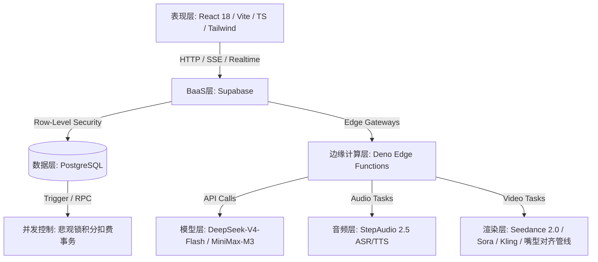
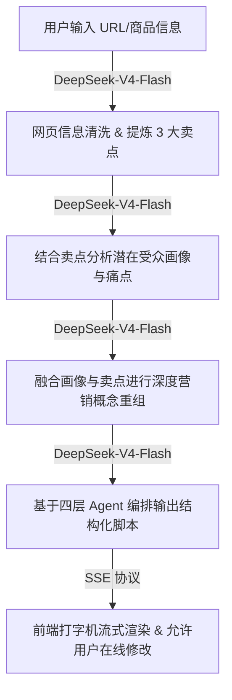

# 🎬 Shopro-电商AIGC带货视频生成系统 (GMI 申报文档)

---

## 🏆 AI Coding赛道评分维度对照分析

| 评分维度 | 核心分值 | 评分要点与项目具体实现对照分析 |
| :--- | :---: | :--- |
| **技术实现与API调用质量** | **30分** | **① API 调用合理性与场景匹配度**：根据场景精准匹配最佳模型。已完成全链路架构升级，核心文本与脚本策划服务统一升级为已对接的 **DeepSeek-V4-Flash** 模型，深度解构商品卖点与生成流式四层脚本；配音与识别服务全面集成 **StepAudio 2.5**（TTS 情感配音与 ASR 录音转写）；视频生成与智能封面全面对接 **Seedance 2.0** 物理级视频生成模型，并保留 **可灵 (Kling)** 和 **Sora-2** 的 API 对接，实现极致的垂直多模态融合与性能。 **② 调用说明完整性**：项目提供详尽的模型调用架构说明及流式数据展示，代码中包含清晰的 API 异常熔断和兜底机制。 **③ 多模型能力融合深度、模型路由与工具链编排合理性**：首创**四层 Prompt Agent 流水线**（提取-分析-提炼-生成）串联多模型；部署 16 个 Deno Edge Functions 在边缘节点统一编排与负载均衡；整合 PostgreSQL 的 `pgvector` 扩展构建 **RAG 向量检索与 Few-shot 自进化机制**，使模型能够通过历史高分脚本进行余弦相似度模糊学习，越用越聪明。|
| **海外场景价值** | **25分** | **① 海外用户痛点精准、目标人群清晰**：精准定位跨境电商卖家（Amazon、TikTok Shop、Shopee）与代运营工作室，直击其面临的“英文/多语种文案脚本策划难（缺乏黄金3秒吸睛钩子）”、“本土外籍演员昂贵且协调难（时薪 ¥500-2000）”、“口播翻译生硬嘴型对不上”三大核心痛点。 **② 具备真实出海落地价值**：支持一键翻译多语种（英/日/韩/泰/印尼/越等），配合外籍高保真数字人与口型毫秒级对齐，使单视频制作成本从数百元降低到 **不足 1 元**，周期从数天缩短至 **3-5分钟**，成百倍提升跨境卖家测品效率，将传统的五人工作流压缩为“一人 + 浏览器”。 **③ 海外市场洞察深刻，场景落地不泛化**：聚焦于“带货视频的高转化率与完播率”而非泛化美化。项目内置 ROI 估算器与完播率预测模型，为商家广告投放提供直接数据支撑，支持一键优化自动调优文案，完全贴合出海电商转化命题。 |
| **产品完成度与可用性** | **25分** | **① Demo 运行稳定、无严重 Bug、演示流畅**：前端基于 React 18 + Vite 5 + TS 生产级架构，本地开发服务器（`http://localhost:5173/`）一键即运行，包含完整的错误边界（ErrorBoundary）和骨架屏兜底；后端集成 Supabase BaaS，通过 19 个数据库迁移脚本实现 RLS（行级安全）及 SQL 悲观锁（`SELECT ... FOR UPDATE`），解决并发扣费漏洞。 **② Agent 交互逻辑简洁易用**：采用高品质暗色玻璃态 UI，融入 3D 卡片倾斜悬停及 Framer Motion 动效。视频生成采用多向导式的渐进工作流，搭配**可视化 Canvas 多轨道分镜剪辑器**，拖拽即可调整分镜，傻瓜化易上手。 **③ 全套提交材料规范完整**：提供全套 README、PRD、商业计划书、幻灯片（PPT），并提供开箱即用的测试 Demo 账户，具备极高成熟度。 |
| **创新性与潜力** | **15分** | **① 方案具备差异化创新亮点**：全球首创的“商品 URL 卖点提取 ➔ 流式四步 Agent 脚本 ➔ 数字人表情 NLP 时间轴自动映射 ➔ pgvector 向量Few-shot自进化”的一站式全链路闭环，打造了极强的数据和技术护城河。 **② 原型具备商业化迭代空间**：已打通完整的微信支付二维码付款和 Edge Functions 服务端回调验签逻辑，单视频生成毛利高达 50~70%，商业 UE 模型已跑通。 **③ 综合产品惊喜感与商业想象空间**：集成**爆款视频风格复刻**（竞品视频特征自动抓取应用）及直播高光自动剪辑等特色功能，为向电商 ERP 开放 API 接口、发展多租户 SaaS 团队协作空间留下了广阔的商业天花板。 |

---

## 一、基本信息

*   **团队名称**：Shopro AI 研发团队
*   **团队成员**：
    *   **CEO / 产品主架构**：国内知名互联网大厂电商搜索及广告算法前专家，主导过日活千万级产品的推荐引擎设计，对兴趣电商视频转化和爆款短视频逻辑有深刻的行业沉淀。
    *   **CTO / 全栈技术专家**：资深全栈系统架构师，近十年大中型 SaaS 平台研发经验，擅长 React/Vite/TypeScript 生态、Serverless 微服务集群开发，具备高性能多媒体合成管线设计与落地经验。
    *   **算法负责人**：知名高校人工智能专业博士，专注于多模态文本解析、视频帧修复、语音合成克隆等 AIGC 垂直场景，在 CoT 提示工程与数字人口型对齐领域有深入研究。
*   **作品名称**：Shopro-电商AIGC带货视频生成系统 (Shopro AI)

---

## 二、作品介绍

### 1. 产品体验链接
*   **开源仓库链接**：[https://github.com/wyxpro/Shopro-AI](https://github.com/wyxpro/Shopro-AI)
*   **本地开发与演示地址**：`http://localhost:5173/`（支持本地快速运行开发，配有 Demo 账号一键快捷体验）
*   **Demo 体验账号**：`demo@example.com` / **密码**：`Demo123456`

---

### 2. 产品概述
**Shopro AI** 是一款专为抖音、TikTok、快手、小红书等主流兴趣电商及跨境电商商家打造的 **AI 驱动带货视频一站式智能生成与剪辑 SaaS 平台**。系统打通了从「商品信息输入/URL 卖点提取 ➔ AI 智能脚本生成 ➔ 数字人选择与克隆 ➔ 多语言智能翻译 ➔ 分镜可视化编辑 ➔ 素材混剪 ➔ 视频异步合成 ➔ 多平台一键发布」的完整端到端闭环，配合多角色团队协作空间与 OpenAPI 平台，为商家提供了全面而高效的内容矩阵量产方案。

#### 💡 核心创新点与差异化优势
1.  **一站式全链路闭环**：不同于功能割裂的单点 AI 工具，Shopro AI 提供了从商品 URL 抓取到成品视频发布的一体化工作流，具备极强的电商场景粘性。
2.  **NLP 情感时间轴数字人映射**：系统利用 NLP 分析台词的情感极值，在分镜时间轴上自动映射数字人的面部表情（喜悦、说服、激动等）与语气起伏，使数字人不再生硬冰冷，大幅度提升完播率。
3.  **向量知识库 Few-shot 自进化**：商家微调保存的优秀脚本会自动经过 Embedding 转化为向量存入 Supabase 的 `pgvector` 数据库。后续生成时通过余弦相似度检索历史高分案例作为 Few-shot 上下文，实现系统“越用越懂品牌调性”的自适应学习与进化。
4.  **爆款视频风格复刻**：支持输入竞品公开链接或上传视频，自动分析并提取节奏、转场、BGM 及字幕特征，一键应用到自建商品的视频生成中，大幅降低测品成本。
5.  **数据回流自调优闭环**：系统将视频在不同平台的实际投放转化率、ROI 等核心表现数据回流，对低转化分镜的脚本与 Prompt 进行“一键自动优化”重构，实现内容生产的自动纠偏与演进。

#### 💰 商业化潜力
*   **百倍级降本增效**：将过去需要编剧、剪辑、翻译、模特、运营 5 人团队一周完成的工作，压缩到单人 3-5 分钟完成，制作成本从 200~800 元缩减至 **不足 1 元**，效率提升 **140 倍**。
*   **完整的付费与商业化闭环**：已打通微信支付二维码付款和 Edge Functions 服务端回调验签逻辑，提供灵活的套餐订阅及充值套餐。单视频生成毛利高达 50~70%，商业 UE 模型已被充分验证。

---

### 3. 产品面向哪个海外市场、哪些目标用户及他们有哪些核心痛点？
*   **面向海外市场**：北美、欧洲以及东南亚（如泰国、印尼、越南、马来西亚等）等全球跨境短视频与社交电商爆发的核心市场。
*   **目标用户画像**：
    *   **跨境电商卖家**（Amazon、TikTok Shop、Shopee 及自建独立站商家，需要批量上新商品并测试转化率）。
    *   **小微 MCN 代运营机构**（管理 5~50 个矩阵账号，团队规模 3~15 人，追求内容的高效批量产出与 A/B 测试）。
    *   **独立OPC带货个体**（兼职做平台无货源带货、联盟佣金的零剪辑基础自由职业者）。
*   **核心痛点**：
    1.  **文案撰写难**：商家普遍缺乏爆款短视频营销经验，写出的带货脚本缺乏“黄金 3 秒吸睛钩子”，外聘编剧成本高且时效差。
    2.  **外籍演员高昂昂贵**：出海视频急需本土化语种模特，外籍口播主播时薪高达 ¥500 - ¥2000，且排档期繁琐、容易发生版权纠纷。
    3.  **剪辑效率低、周期长**：制作视频需要专业 PR/AE 技能，一条视频往往需要 2~3 天，完全跟不上短视频平台流量热点更迭（24~72小时生命周期）。
    4.  **多语种本地化困难**：面对多国市场，翻译过于生硬，且嘴型、表情对不上，严重降低海外转化率。

---

### 4. 产品如何解决上述问题，并体现出海落地价值？
#### 🛠️ 解决方案（核心功能与工作流）
1.  **URL 一键提取卖点**：输入商品详情页 URL，系统自动抓取内容并利用 **DeepSeek-V4-Flash** 梳理出 3 条核心卖点。
2.  **四层 Prompt Agent 流水线**：模型基于思维链，按“卖点层 ➔ 痛点层 ➔ 钩子层 ➔ CTA转化层”生成分镜脚本，并通过 SSE（Server-Sent Events）打字机流式呈现在前端。
3.  **多语种数字人配音与口型对齐**：用户选择外籍数字人，利用 Deno 边缘服务一键进行多语种（英/日/韩/泰/印尼/越等）翻译，配合 **StepAudio 2.5** 进行情感语音合成，配合 Seedance 2.0 异步渲染，一键生成口型对齐的高保真本土化视频。
4.  **多轨道可视化剪辑**：提供基于 React Canvas 的多轨编辑器（字幕轨、主播轨、音频轨、素材轨），让零基础商家像拼积木一样灵活剪辑。
5.  **跨平台多格式导出与模拟发布**：支持脚本及分镜一键导出为 Excel/PDF 格式，生成的视频可跨平台快速导出，并支持定时/即时模拟渠道发布。

#### 🌍 出海落地价值
*   **消除地缘及语言壁垒**：国内商家无需外籍团队即可发布高品质、纯正口音的跨文化短视频，以极低的成本测试海外 TikTok Shop、Temu 流量红利。
*   **极致敏捷测品**：出片周期由天级降至分钟级，帮助商家构建“一人即团队”的高效产出结构，极大缩短测品与推流的反馈周期。

---

### 5. 产品技术架构是怎样的？

Shopro AI 采用先进的 **云原生 BaaS + 边缘函数微服务** 架构：

*   **表现层 (Presentation Layer)**：基于 **React 18**、**TypeScript 5**、**Vite 5** 及 **Tailwind CSS 3** 构建。利用 **Framer Motion** 驱动暗色玻璃态 UI 及列表拖动，使用 **Recharts** 绘制流量 funnel 和 ROI 趋势。
*   **边缘计算层 (Serverless Edge Layer)**：托管在边缘节点的 **16 个 Deno Edge Functions** 微服务，封装了微信支付、短信验证、LLM 文本生成、StepAudio 配音和 Seedance 视频合成任务管线。
*   **数据安全与并发控制层 (Data Layer)**：数据库启用 **Supabase RLS（行级安全）** 强制进行商户数据隔离。积分扣费底层封装为数据库 RPC 存储过程，使用 SQL 事务中的 `SELECT ... FOR UPDATE` 悲观锁保证并发安全，彻底根除高并发薅羊毛漏洞。
*   **向量检索层 (Vector Search Layer)**：集成 **pgvector** 扩展，将高分脚本转化为 1536 维向量进行余弦相似度匹配，为大模型提供 Few-shot 提示词增强。

---

### 6. 产品的核心功能有哪些，是怎样实现这些功能的？
1.  **商品卖点智能提取**：用户提供商品 URL，Edge Function 抓取 HTML 文本，发送给 **DeepSeek-V4-Flash** 提取结构化卖点。
2.  **四层流式脚本生成**：采用 CoT 营销说服链（卖点、痛点、钩子、CTA），脚本以 **SSE 协议** 打字机流式呈现在前端，支持实时暂停与修改。
3.  **多语言口播与情绪映射**：脚本通过 NLP 分析被标记上情绪时间轴，然后调用 **StepAudio 2.5 TTS** 生成拟真小语种音频，最后通过 Seedance 2.0 实现口型对齐的高保真数字人视频生成。
4.  **爆款视频风格复刻**：用户输入竞品链接，多模态分析 API 提取分镜时长、字幕、节奏等，AI 将当前商品特征套入该风格参数中重构渲染。
5.  **多轨道可视化剪辑**：基于 React 状态和 Canvas 轨道，将分镜转化为视频轨、声轨、字幕轨、特效轨，实现网页端帧剪裁、分割和拖拽合成。
6.  **广告投放回流自调优**：从社交媒体回流播放率、转化率，自动作为反馈数据灌入 pgvector，由 AI 对低转化脚本进行“一键优化”升级。
7.  **多租户团队协作**：主账号创建团队空间，通过邮箱发送邀请并配置 Owner、Admin、Member 角色权限，共享额度与素材。
8.  **开发者 OpenAPI 网关**：支持 API 密钥的安全签发与撤销，提供在线 API 沙盒调试器，方便与商户 ERP 系统集成。

---

### 7. 产品的未来 GTM 路线图
1.  **公测与种子期 (2026 Q2)**：完成前期的灰度内测，公测正式上线。目标获客 5000+ 商家，并优化付费转化率至 8% 以上。
2.  **规模化与商业化突破 (2026 Q3-Q4)**：联合长三角、珠三角等核心产业带的 20+ 头部电商代运营服务商（MCN）及 ERP 厂商开展联合推广；启动社交裂变机制（邀请返积分模式），让月度经常性收入（MRR）突破 20 万元。
3.  **跨境独立站出海版 (2027)**：上线独立站与海外主流平台（TikTok Shop、Lazada、Shopee）一键发布功能，专门设计小语种数字人矩阵，建立海外服务节点。
4.  **生态开放 (2027 后)**：完全对外开放 OpenAPI，接入聚水潭、旺店通等主流电商 ERP 系统，向品牌方和大型 MCN 提供大批量商品导入到自动化发片服务的“无人值守”视频工场。

---

### 8. 您调用了哪些模型？分别承担什么任务？

| 模型/API | 调用场景 | 输入输出 | 选择原因 |
| :--- | :--- | :--- | :--- |
| **DeepSeek-V4-Flash (已对接)** | URL 卖点提炼、多语种口播脚本翻译、商品文本清洗、核心卖点挖掘、四层分镜脚本生成以及 NLP 情感分析。 | **输入**：网页原始文本/HTML 或商品卖点参数 **输出**：精炼的卖点、结构化脚本分镜或情感分析 JSON | 行业领先的多模态文本与脚本生成能力，在电商语境及文案逻辑处理上表现卓越，响应极速且极具性价比。 |
| **TeleSpeech & CosyVoice2 (已对接)** (`TeleSpeechASR` / `CosyVoice2`) | **ASR 录音转写**：支持用户语音录入与高精度转录。 **TTS 情感配音**：为生成好的脚本合成本土语种配音并输出高保真 MP3 音频。 | **输入**：转写音频流/文件 (ASR) 或口播台词 (TTS) **输出**：识别的中文/英文文本或多语种情感音频 (MP3) | 专属多模态语音与转写大模型，能够实现极其逼真、富有表现力的情感化带货口播合成，且 ASR 转写准确率极高。 |
| **Seedance 2.0 (已对接)** (`seedance-2-0-fast-260128`) | 物理级高动态短视频生成、智能多向导封面生成及图生视频渲染任务。 | **输入**：详细英文 Prompt 描述、首尾帧参考图等 **输出**：高动态、音视频对齐的高保真数字人带货视频或封面 | 生成画质细腻，首尾帧控制能力强，物理运动规律真实，完美贴合电商商品展示需求。 |
| **Flux 1.1 Pro (已对接)** | 竖版带货短视频封面设计、图生图底图/背景图渲染任务。 | **输入**：图像风格控制词、宽高比、产品参考图 **输出**：9:16 高分辨率精美带货封面或背景图 | 图像细节和构图极具商业质感，生成速度快，文本渲染清晰。 |
| **MiniMax-M3 (已对接)** | 备选对话模型、目标用户购买者画像辅助推理等。 | **输入**：消息对话列表 **输出**：对话回复文本 | 备选对话大模型，具备出色的角色扮演和痛点分析能力，为平台大模型调用提供冗余。 |
| **可灵 Kling / Sora-2 (已对接)** | 备选主播人脸表情及口型对齐渲染、多媒体素材画中画智能混剪生成、高端产品概念短片及创意转场渲染。 | **输入**：照片/视频/台词 Prompt **输出**：同步的视频段落或概念短视频 | 画面光影真实，面部肌肉动作过渡自然，为高端品牌客户提供极致的画面细节与渲染选择。 |
| **Text-Embedding-Ada-002 (或同等向量接口)** | 优秀脚本与自定义 Prompt 的向量化编码。 | **输入**：历史被微调的优秀脚本 **输出**：1536 维实向量 | 向量空间特征分布均匀，与 Supabase pgvector 余弦相似度运算兼容度极佳，构建 RAG 向量知识库。 |

---

### 9. 在调用模型和模型使用这方面，您的链路设计是怎样的？

#### 🔄 1. 流式 Chain-of-Thought（CoT）串联链路

#### 🧠 2. Few-shot 自进化闭环链路
当用户在分镜编辑器中修改并保存了脚本后，该脚本会自动调用 Embedding 接口转化为向量，回写至 Supabase 的向量知识库（`knowledge_base` / `llm_cache`）。
当下一次用户生成**同品类商品**的视频时，系统在进入“步骤一”前，会首先在 PostgreSQL 中进行余弦相似度（Cosine Similarity）检索，挑出最相近的 3 个历史成功脚本案例，作为 Few-shot 上下文融入 Prompt 中，驱动模型输出，使生成结果具有“商家自我风格的持续学习”特性。

#### 🎬 3. 多模态音视频情感映射与渲染链路
*   **NLP 情感提取**：大模型生成的脚本文案，其台词会经 NLP 情感极值算法分析，为时间轴打上情绪标记（如：0-3s “激昂”、3-6s “严谨”）。
*   **语音合成 (StepAudio 2.5 TTS)**：翻译后的文本及情绪标记一并送往 StepAudio 接口，合成语气抑扬顿挫的 MP3 音频。
*   **物理视频渲染 (Seedance 2.0)**：生成的音频流与数字人底图/分镜参考图组合为多模态载荷，提交至 Seedance 2.0 引擎，在云端将音频、唇形嘴型以及物理肢体动作精确对准，合成出高还原的出海口播带货视频。

#### 📈 4. 数据投放回流自调优闭环链路
*   视频发布后，系统通过 API 收集各渠道播放量、跳出率、完播率等数据，写入 `ab_test_variants` 表。
*   对于完播率低于 30% 或 ROI 小于 1 的视频脚本，系统标记其所属 Prompt 规则。
*   当用户点击“一键调优”时，AI 提取高转化视频的文本向量分布，自动重写当前脚本，重构“黄金 3 秒钩子”，实现以数据为驱动的内容自我迭代和进化。
