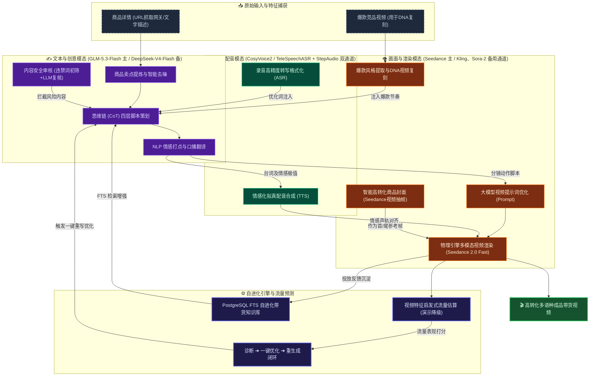

# 🤖 Shopro-电商AIGC带货视频生成系统 AI能力需求与提示词策略分析报告

> 本报告针对 Shopro AI 系统涉及的各项 AI 能力进行全面深度分析，归纳整理核心 AI 接口需求、**实际已对接的 AI 模型选型**、**API 估算价格** 以及具体的提示词（Prompt）工程编排策略。
> 报告内容已对照代码库实际实现核校（核校基线：2026-09-26，覆盖 `supabase/functions/` 全部边缘函数、`src/` 前端服务层、`supabase/schema.sql` 与 migrations、`mcp/` 服务），并明确区分 **真实对接 / 演示降级 / 未对接** 三种状态，为开发团队和申报评审提供清晰的技术指引。本轮核校同步纳入积分体系端到端调整（注册赠 20 积分、生成固定 10 积分/次、余额不足自动弹充值窗、失败自动退款，提交 4c7c150 / 4994e20）。

## 🗺️ Shopro AI 多模态生成与优化架构图



### 💡 一句话核心流程描述
> **全链路智能生成与自进化闭环**：系统通过网页抓取网关读取商品链接或分析竞品视频，利用 GLM-5.3-Flash（主，Sophnet 平台）提取卖点并生成四层说服结构脚本，智能对齐 FunAudioLLM/CosyVoice2-0.5B 情感化配音与 doubao-seedance-2-0-fast（主）/ Kling / Sora-2（备用网关）多模态画面渲染，由特征启发式流量估算和 PostgreSQL 全文检索知识库驱动内容诊断与自进化改写，实现从商品到高转化带货短视频的极速闭环生成。所有 LLM 输出均带 **降级兜底（degraded 标记 + 预设模板）**，保证无外部 Key 时产品链路依然完整可用。

### 🎨 架构概念图生图提示词 (Prompt)
```text
A futuristic dark-mode tech dashboard visualization representing multi-modal AI video generation. In the center, a glowing digital film strip displays flowing sequences of e-commerce products and human avatars, flanked by abstract holographic nodes showing waves of text data (Chinese/English), audio frequency waves, and colorful code snippets. Glowing light beams flow from input devices into the central rendering core, with futuristic UI widgets, data visualization graphs, and progress bars. High-tech, clean asymmetrical composition, dark background (#0a0c0f) with neon accents of orange (#FF6B00), emerald green, and electric blue, octane render, 16:9 aspect ratio, cinematic lighting, 8k resolution --ar 16:9
```

## 📌 AI能力核心概览摘要表 (按模态分类)

<table width="100%">
  <thead>
    <tr>
      <th align="left">模态分类</th>
      <th align="left">核心能力</th>
      <th align="left">已对接模型</th>
      <th align="left">估算价格 (API)</th>
      <th align="left">提示词与核心策略</th>
    </tr>
  </thead>
  <tbody>
    <tr>
      <td rowspan="6" valign="top"><b>✍️ 文本语言</b></td>
      <td>商品网页卖点提取</td>
      <td>GLM-5.3-Flash (已对接)</td>
      <td>以 Sophnet 平台计费为准</td>
      <td>抓取网关取 Markdown，限制15字以内JSON输出</td>
    </tr>
    <tr>
      <td>商品基础卖点生成</td>
      <td>GLM-5.3-Flash (已对接)</td>
      <td>以 Sophnet 平台计费为准</td>
      <td>多维度价值约束，直击痛点避免空泛</td>
    </tr>
    <tr>
      <td>流式四步脚本生成</td>
      <td>GLM-5.3-Flash (已对接)</td>
      <td>以 Sophnet 平台计费为准</td>
      <td>CoT思维链，四层营销框架 (卖点/痛点/Hook/CTA)</td>
    </tr>
    <tr>
      <td>台词情绪 NLP 分析</td>
      <td>GLM-5.3-Flash (已对接)</td>
      <td>以 Sophnet 平台计费为准</td>
      <td>分类标签情感分类器，打出情绪波动分</td>
    </tr>
    <tr>
      <td>多语言口播脚本翻译</td>
      <td>GLM-5.3-Flash (已对接)</td>
      <td>以 Sophnet 平台计费为准</td>
      <td>本地化转译与口语化改写，保持原有行结构</td>
    </tr>
    <tr>
      <td>内容安全审核</td>
      <td>GLM-5.3-Flash (已对接)</td>
      <td>以 Sophnet 平台计费为准</td>
      <td>违禁词初筛 + LLM 复核 + fail-close 防御</td>
    </tr>
    <tr>
      <td rowspan="2" valign="top"><b>🎵 音频语音</b></td>
      <td>情感化配音生成</td>
      <td>FunAudioLLM/CosyVoice2-0.5B (已对接)</td>
      <td>约 ￥0.005 / 千字</td>
      <td>默认音色 fnlp/MOSS-TTSD-v0.5，情感口播音轨合成</td>
    </tr>
    <tr>
      <td>录音转写与语音输入</td>
      <td>TeleAI/TeleSpeechASR + StepAudio 2.5 ASR (双通道已对接)</td>
      <td>约 ￥0.005 / 分钟</td>
      <td>高精度抗噪转录，口语自适应转书面语</td>
    </tr>
    <tr>
      <td rowspan="4" valign="top"><b>👁️ 视觉与多模态</b></td>
      <td>视频提示词优化</td>
      <td>GLM-5.3-Flash (已对接)</td>
      <td>以 Sophnet 平台计费为准</td>
      <td>镜头、光线与微动效果增强优化</td>
    </tr>
    <tr>
      <td>智能高转化封面</td>
      <td>doubao-seedance-2-0-fast (已对接)</td>
      <td>约 ￥0.15 / 5s封面视频</td>
      <td>Seedance 生成 5s 9:16 视频后抽取缩略图，落库 cover_candidates</td>
    </tr>
    <tr>
      <td>竞品视频风格复刻</td>
      <td>GLM-5.3-Flash (已对接，LLM降级预设兜底)</td>
      <td>以 Sophnet 平台计费为准</td>
      <td>解构节奏、配乐、字幕与切片建立竞品DNA</td>
    </tr>
    <tr>
      <td>视频渲染生成与合成</td>
      <td>doubao-seedance-2-0-fast (主力，已对接)；Kling、Sora-2 (备用网关，已对接)</td>
      <td>约 ￥0.15 / 视频秒数；Kling/Sora 以网关计费为准</td>
      <td>影视级场景运动控制，支持首帧参考图与 720p/时长/比例参数注入；固定计费 10 积分/次，失败自动退还</td>
    </tr>
  </tbody>
</table>

---

## 📊 一、AI能力需求、模型推荐与提示词策略矩阵（按模态分类汇总）

### 1. ✍️ 文本语言与营销策划模态（Text & Language Modality）

| 序号 | 核心AI能力需求 | 实际对接模型 | API 估算价格 | 典型输入与输出示例 | 提示词策略与核心 Prompt 设计 |
| :--: | :--- | :--- | :--- | :--- | :--- |
| 1.1 | **商品网页卖点智能提取**(`extract_url_selling_points`) | **GLM-5.3-Flash (已对接)** /GPT-4o-mini | GLM-5.3-Flash: 以 Sophnet 计费为准GPT-4o-mini: 约 ￥0.001 / 千 token | **输入**：抓取网关返回的商品详情 Markdown（截断 15000 字符）**输出**：JSON 格式的 3 条核心卖点 | **【限制性结构提示词】**通过网页抓取网关（`X-Return-Format: markdown`）预先去噪，再由 Prompt 约束大模型。要求输出每条不超过 15 字，符合抖音短视频字幕规范。要求严格输出 JSON（`{"selling_points": [...]}`），失败时返回提示性兜底文案。 |
| 1.2 | **商品基础卖点生成**(`generate_selling_points`) | **GLM-5.3-Flash (已对接)** /Qwen-Turbo | GLM-5.3-Flash: 以 Sophnet 计费为准Qwen-Turbo: ￥0.002 / 千 token | **输入**：商品名、类目、简短描述**输出**：3条独特维度的精简卖点 | **【多维度价值约束提示词】**约束大模型必须从功能、情感、场景、价格四个独特维度中选择 3 个进行重写。明文禁止"高品质"、"多功能"等空泛词。LLM 异常时按品类（美妆/服装/家居/数码/食品）降级返回预置卖点模板，并携带 `degraded` 标记。 |
| 1.3 | **流式四步脚本生成**(`generate_script_four_layer`) | **GLM-5.3-Flash (已对接)** /Claude 3.5 Sonnet | GLM-5.3-Flash: 以 Sophnet 计费为准Claude 3.5: 输入￥0.021，输出￥0.105 / 千 token | **输入**：商品卖点、目标受众、痛点、平台、时长**输出**：5个分镜的 JSON 数组（含 Prompt、台词及对应四层标注） | **【角色演化与 CoT 链式提示词】**定义系统角色为"电商带货脚本策划师"，将脚本约束在**四层营销结构**中（卖点层、痛点层、钩子层、CTA层）。支持从 `prompt_templates` 表读取启用版本模板，并按 userId SHA-256 哈希做 **A/B 分流**；无模板时降级内置四层 Prompt。 |
| 1.4 | **台词情绪 NLP 分析**(`emotion_analysis`) | **GLM-5.3-Flash (已对接)** /GPT-4o-mini | GLM-5.3-Flash: 以 Sophnet 计费为准GPT-4o-mini: 约 ￥0.001 / 千 token | **输入**：单句台词序列**输出**：情绪类型（hook/pain_point/cta等）、情绪强度 | **【分类标签情感分类器提示词】**要求大模型作为情绪分析师，对各句台词的情感类别进行归类，并打出 0-100 的情绪波动分，以便前端渲染情绪波形图并控制数字人嘴型及面部表情。 |
| 1.5 | **多语言口播脚本翻译**(`translate_script`) | **GLM-5.3-Flash (已对接)** /GPT-4o | GLM-5.3-Flash: 以 Sophnet 计费为准GPT-4o: 输入￥0.035，输出￥0.105 / 千 token | **输入**：源脚本、源语言、目标语言**输出**：目标语种的带货营销语气文本 | **【本地化改写提示词】**不仅是直接直译，而是要求模型在转译为目标语言（英/日/韩/泰等）时进行"本土化口语改写"。确保台词符合当地消费者的口语习惯，并在翻译后仍保持原有分镜的行结构。 |
| 1.6 | **内容安全审核**(`content_moderation`) | **GLM-5.3-Flash (已对接)** | 以 Sophnet 计费为准（审核动作计入积分） | **输入**：待发布脚本/文案**输出**：审核决定（pass/block/review）、命中类别与依据 | **【三层防御提示词】**先经本地违禁词表（博彩/毒品/色情/洗钱等）初筛，命中即阻断；未命中再交 LLM 复核语义风险；风控命中事件写入 `risk_events` 表供后台审计，写入失败不影响主流程，审核查询采用 **fail-close** 策略。 |
| 1.7 | **A/B 文案变体生成**(`generate_ab_variants`) | **GLM-5.3-Flash (已对接)** | 以 Sophnet 计费为准 | **输入**：原始台词/卖点**输出**：多组风格化变体文案 | **【多风格裂变提示词】**基于同一信息内核生成不同情绪基调（悬念型/种草型/促销型）的变体，供投放端 A/B 测试择优。 |
| 1.8 | **预设模板分镜**(`generate_storyboard`) | 无外部模型（**演示降级**） | ￥0 | **输入**：商品名、卖点**输出**：5 段预设分镜（钩子/痛点/方案/演示/CTA） | **【模板兜底策略】**未接入外部故事板模型，返回固定五段式模板分镜并携带 `degraded: true` 标记，保证前端时间轴链路完整可演示。 |

### 2. 🎵 音频与语音识别模态（Audio Modality）

| 序号 | 核心AI能力需求 | 实际对接模型 | API 估算价格 | 典型输入与输出示例 | 提示词策略与核心 Prompt 设计 |
| :--: | :--- | :--- | :--- | :--- | :--- |
| 2.1 | **情感化多语种配音生成**(TTS 语音合成) | **FunAudioLLM/CosyVoice2-0.5B (已对接)** /MiniMax 情感 TTS | CosyVoice2: 约 ￥0.005 / 千字 | **输入**：口播台词文本、音色 ID**输出**：高保真 MP3 音频文件 | **【情感状态控制参数】**基于 SiliconFlow 平台 `/audio/speech` 接口调取 CosyVoice2-0.5B，默认音色 `fnlp/MOSS-TTSD-v0.5:alex`，支持多音色切换与多语种情感口播音轨合成。 |
| 2.2 | **录音转写与语音输入**(ASR 语音转文字) | **TeleAI/TeleSpeechASR (已对接)** + **StepAudio 2.5 ASR (已对接)** 双通道 /Whisper | TeleSpeechASR: 约 ￥0.005 / 分钟 | **输入**：录音语音分片 Base64 / FormData 音频文件**输出**：识别的中文/英文文案文本 | **【双通道高精度转录】**主通道走 SiliconFlow `TeleAI/TeleSpeechASR`（`/audio/transcriptions`），备用通道走 StepFun `stepaudio-2.5-asr`（`api.stepfun.com`），实现抗噪录音识别与口语自动转书面语。 |

### 3. 👁️ 视觉图像与多模态合成模态（Vision & Multimodal Synthesis Modality）

| 序号 | 核心AI能力需求 | 实际对接模型 | API 估算价格 | 典型输入与输出示例 | 提示词策略与核心 Prompt 设计 |
| :--: | :--- | :--- | :--- | :--- | :--- |
| 3.1 | **大模型视频提示词优化**(`optimize_prompt`) | **GLM-5.3-Flash (已对接)** /GPT-4o | GLM-5.3-Flash: 以 Sophnet 计费为准GPT-4o: 输入￥0.035，输出￥0.105 / 千 token | **输入**：用户原始创意 Prompt、产品、风格**输出**：增强后的专业英文多模态 Prompt | **【画质与镜头增强提示词】**将用户的简短提示词翻译并扩展为符合视频生成模型的专业 Prompt。加入光线（cinematic lighting）、色彩、镜头运动（slow zoom-in）、平台节奏与字幕样式；异常时降级拼接模板化增强后缀。 |
| 3.2 | **智能高转化封面生成**(`generate_cover` / `query_cover_task`) | **doubao-seedance-2-0-fast (已对接)** | 约 ￥0.15 / 5s 封面视频 | **输入**：产品名、目标平台、风格主题**输出**：9:16 竖版封面图（视频抽帧）+ `cover_candidates` 候选记录 | **【视频抽帧封面策略】**自动注入 `--resolution 720p --duration 5 --aspect_ratio 9:16` 参数生成短封面视频并抽取缩略图；TikTok 平台使用英文高对比 Prompt（"vibrant colors, bold text overlay, 9:16 vertical, high contrast"），任务异步落库轮询查询。 |
| 3.3 | **竞品视频风格复刻**(`analyze_style` / `analyze_style_deep`) | **GLM-5.3-Flash (已对接)** /Claude 3.5 Sonnet | GLM-5.3-Flash: 以 Sophnet 计费为准Claude 3.5: 输入￥0.021，输出￥0.105 / 千 token | **输入**：竞品视频链接 / 数据参数**输出**：爆款要素分析报告、DNA指纹及复刻建议 | **【多维解构提示词】**命令 LLM 作为短视频内容分析师，从节奏类型、配乐情绪、字幕描边、镜头切分四个维度建立竞品 DNA，输出含 rhythm/virality/completion 三项评分及优势、劣势和一键套用建议的 JSON 报告；LLM 失败时降级返回预设爆款特征并标记 `degraded`。 |
| 3.4 | **视频生成渲染**(`generate_video` / `submitSeedanceVideo`) | **doubao-seedance-2-0-fast-260128 (主力，已对接)**、**Kling (已对接，omni-video 网关)**、**Sora-2 (已对接，openai/v1/videos 网关)** | Seedance: 约 ￥0.15 / 视频秒数；Kling/Sora 以网关计费为准 | **输入**：Prompt描述、首帧参考图、画面宽高比、时长**输出**：高动态、多模态口播与场景对齐的合成视频 | **【影视级场景生成控制】**Seedance 经 `draw.openai-next.com` 直连代理，自动注入分辨率/时长/比例参数，支持 materials 中图片作为 `first_frame` 首帧参考；Kling 走 omni-video 网关、Sora-2 走 openai videos 网关作为备用通道；未配置 Key 时降级为 DB 进度模拟（mock）保证链路可演示。计费：固定 10 积分/次（余额不足时前端守卫直接拦截并弹出充值窗），任务失败自动退还。 |

### 4. ⚙️ 自进化引擎与开放生态（Engine & Ecosystem）

| 序号 | 核心AI能力需求 | 实际对接模型 | 实现状态 | 典型输入与输出示例 | 提示词策略与核心设计 |
| :--: | :--- | :--- | :--- | :--- | :--- |
| 4.1 | **流量/完播率预测**(`analyze_traffic`) | 无外部模型（**启发式估算，演示降级**） | 规则引擎已上线 | **输入**：时长、字幕、节奏、BGM、品类**输出**：完播率/点击率预估 + 分级优化建议 | **【特征加权启发式】**基于时长区间、字幕覆盖、剪辑节奏、BGM 节奏、品类系数进行加权估算并叠加随机扰动，输出 duration/subtitle/pacing/bgm/cta 五类优化建议；响应携带 `degraded: true` 与原因说明，待接入抖音/TikTok 开放平台真实播放数据后可平滑升级为真实预测模型。 |
| 4.2 | **知识库自进化检索**(`knowledge_rag_search`) | PostgreSQL FTS（**全文检索，已上线**） | 已上线（非向量方案） | **输入**：user_id + 查询词**输出**：按质量分排序的知识条目 | **【全文检索 RAG】**基于 `knowledge_entries` 表 tsvector 索引做全文检索，按 `quality_score` 排序返回；零结果时降级 `ilike` 标题模糊匹配。向量 embedding 方案为后续演进方向。 |
| 4.3 | **竞品管理与直播高光分析**(`add_competitor` / `crawl_competitor` / `analyze_live_highlight`) | GLM-5.3-Flash + 抓取网关 | **phase3-assistant** 已上线（高光分析含降级模拟） | **输入**：竞品直播间/视频链接**输出**：直播高光切片清单（类型/时间轴/评分/建议标题） | **【高光切片提示词】**按 product_pitch/demo/promo/qa/reaction 五类标注高光片段，输出起止秒数、评分与二次创作标题建议；LLM 异常时降级为随机模板切片并标记。 |
| 4.4 | **团队协作与开放 API**(`create_team` / `generate_api_key` / `create_publish_task` 等) | 无模型（工程能力） | **phase3-assistant** 已上线 | **输入**：团队/成员/发布任务参数**输出**：团队、API Key、发布任务记录 | 开放平台 API Key 签发与吊销、团队/邀请/角色管理、发布任务创建与执行，构成多租户商业化底座；配合 `update_style_preference` / `generate_personalized_script` 实现风格偏好个性化脚本生成。 |
| 4.5 | **MCP 工具服务**(`mcp/mcp_shopro_server.py`) | DeepSeek-V4-Flash | 已上线（FastMCP） | **输入**：商品描述/URL**输出**：卖点、痛点与营销角度 | 独立 MCP Server 对外暴露 `extract_product_highlights` 等 AIGC 工具，内置 `verify_auth` 鉴权，防止未授权工具调用，可作为第三方集成入口。 |

---

## 二、核心AI服务 (Deno Edge Function) 提示词策略深度解构

在 `ai-assistant` 微服务中，为了确保大模型能够输出高可用、免二次加工的结构化数据，系统采用了以下核心提示词工程（Prompt Engineering）策略：

### 0. 平台级系统 Prompt（`PLATFORM_SYSTEM_PROMPT`）

* **设计原则**：所有文本类 action 共享同一平台级角色设定，确保输出风格统一、紧扣转化目标，并强制 JSON 优先。
* **Prompt 源码级模板**：
  ```markdown
  // System Role: PLATFORM_SYSTEM_PROMPT
  你是「AIGC带货视频平台」的专属AI助手，专门服务于抖音/TikTok电商带货视频的策划、生产与优化。
  核心能力：电商文案、视频脚本、分镜策划、流量分析、风格复刻、Prompt工程。
  工作原则：
  1. 所有输出紧扣「带货转化」目标，以实际效果为导向
  2. 熟悉平台算法规则（完播率、互动率、转化率三角模型）
  3. 文案简洁有力，字幕友好，适合竖屏移动端观看
  4. 优先返回结构化数据（JSON格式），便于前端解析
  5. 在无法分析真实视频内容时，基于行业最佳实践给出专业建议
  ```

### 1. 商品卖点提取 Prompt 策略 (`extract_url_selling_points`)

* **设计原则**：先用网页抓取网关获取 Markdown 并截断至 15000 字符，再利用严格的 JSON 约束避免输出乱码或额外解释文本；LLM 失败时返回可识别的兜底文案。
* **Prompt 源码级模板**：
  ```markdown
  // User Prompt:
  以下是从商品网页中提取的内容，请你分析并生成3条核心商品卖点：
  [网页抓取 Markdown 内容]

  要求：
  1. 每条突出一个独特价值维度（功能/情感/场景/价格）
  2. 语言简洁有力，每条15字以内，适合视频字幕
  3. 针对抖音/TikTok用户心理，具有情感共鸣
  4. 仅输出 JSON，不要其他多余解释。

  直接输出JSON，格式：{"selling_points": ["卖点1", "卖点2", "卖点3"]}
  ```

### 2. 四层结构分镜脚本 Prompt 策略 (`generate_script_four_layer`)

* **设计原则**：引入营销学中的**短视频四层说服框架**（卖点 selling_point、痛点 pain_point、钩子 hook、CTA 行动召唤），通过 CoT（思维链）引导模型不仅输出文案，而且为每一幕的营销属性进行标注，帮助渲染层匹配情绪。**实际代码还支持 `prompt_templates` 数据库模板热切换与按 userId 哈希的 A/B 分流**：读取启用版本模板拼入 System Prompt 尾部（`【当前生效模板 v{version}-{variant}】`），无模板或读取失败时降级为内置四层 Prompt。
* **Prompt 源码级模板**：
  ```markdown
  // System Prompt:
  你是专业的电商带货视频脚本策划师，精通抖音/TikTok短视频「四层结构」创作：
  ① 卖点层（selling_point）：深度理解商品核心差异化价值
  ② 痛点层（pain_point）：匹配目标用户真实痛点与情感共鸣
  ③ 钩子层（hook）：设计平台专属的开场钩子与悬念结构（前3秒留存）
  ④ CTA层（cta）：构建紧迫感与高转化行动召唤

  // User Prompt:
  请基于「四层Prompt工程」为以下商品生成完整带货视频脚本：
  【商品信息】
  - 名称：[商品名称]
  - 品类：[品类]
  - 价格：[价格范围]
  - 核心卖点：[卖点清单]
  【用户信息】
  - 目标用户：[目标画像]
  - 核心痛点：[痛点描述]
  【创作要求】
  - 目标平台：[抖音/TikTok]
  - 建议时长：[视频长度]秒

  请输出以下内容：
  ## 分镜脚本
  5个场景的JSON数组（放在 ```json 代码块中）：
  [{"order":1,"scene":"场景名称（含四层标注）","visual":"画面描述（15-30字）","dialogue":"口播台词","duration":3,"prompt":"英文AI生成Prompt","layer":"selling_point|pain_point|hook|cta"}]

  ## AIGC Prompt
  整体视频的详细英文Prompt（150-200词），放在 ```prompt 代码块中。
  ```

### 3. 台词情绪 NLP 分析 Prompt 策略 (`emotion_analysis`)

* **设计原则**：为了实现数字主播面部表情的自然过渡，大模型必须扮演情感分类器，提取文本背后隐藏的心理潜台词，在时间轴上实现情感的"帧对齐"。
* **Prompt 源码级模板**：
  ```markdown
  你是专业情绪分析师，专注电商带货视频脚本情绪识别。
  分析以下台词句子的情绪类型和强度：
  1. [台词分句1]
  2. [台词分句2]

  情绪类型：hook(钩子)|pain_point(痛点)|product_intro(产品介绍)|social_proof(社会证明)|promotion(促销紧迫感)|cta(行动号召)|neutral(中性)

  直接输出JSON数组（仅JSON）：
  [{"index":0,"text":"原文","emotion":"hook","intensity":85,"color":"#f59e0b","suggestion":"优化建议"}]
  ```

---

## 三、多模型协作链路与工程优化策略

为了确保上述 AI 方案在商用环境下的稳定性、可用性与低延迟，Shopro AI 在工程实施中设计了以下核心优化机制（均已落地）：

1. **Deno Edge Function 边缘编排 + 统一 JWT 鉴权**：
   全量 AI 微服务以 Deno Edge Function 形式部署（`supabase/functions/`），每个函数入口统一执行 `Authorization: Bearer <JWT>` 校验（经 `supabase.auth.getUser` 验证），离商户客户端物理距离最近，请求延迟相比传统中心化服务器更低。
2. **LLM 高可用 Fallback 链路**：
   文本模型采用多供应商故障切换：`ai-assistant` 的 `callLLM` 主通道走 **Sophnet 平台 `GLM-5.3-Flash`**（OpenAI 兼容 `/v1/chat/completions` 接口，密钥经 `GLM_API_KEY` 环境变量注入，已实测连通），失败自动回退 appmiaoda 网关（DeepSeek）；独立 `glm-5-3-flash` 边缘函数提供 **sophnet（GLM-5.3-Flash）→ dxkp（DeepSeek-V4-Flash）→ SiliconFlow（DeepSeek-V4-Flash/V3/Qwen2.5-7B）** 三级降级，切换过程写入 `provider_switch` 日志（`logProviderSwitch`），前端无感知。针对 GLM-5.3-Flash 的思维链（reasoning_content）特性，所有调用预留 `max_tokens ≥ 2048` 防止思维链耗尽预算导致空正文；前端直连链（`sendDeepSeekStreamRequest`）提供 **GLM 直连（vite `/glm-api` 代理映射 Sophnet 真实前缀 `/api/open-apis`）→ dxkp → SiliconFlow** 多级降级，仅取正文 content、静默丢弃思维链，全通道失败时汇总各通道真实失败原因而非笼统超时；工作台提示词增强指令模板收紧为「100 词以内、直接输出一段正文、严禁 Markdown」，实测输出由约 1000 字收敛至 94 字，显著缩短打字机尾程。
3. **LLM 缓存机制 (LLM Cache)**：
   对高频相同的商品网页解析、风格分析等只读型 LLM 动作，系统使用 PostgreSQL `llm_cache` 表（含 `cache_key`、`action`、`response`、`hit_count`、`expires_at`、`prompt_hash`、`tokens_saved` 字段）作为高速缓存层，使用 SHA-256 计算参数特征（`makeCacheKey`）生成缓存键，命中直接返回，显著降低大模型 API 调用开销。
4. **高并发 RPC 积分防薅锁与统一计费规则（00025 端到端调整）**：
   平台积分规则已端到端统一：**新用户注册默认赠 20 积分**（`handle_new_user` 触发器写入 `user_plans` 并生成首条「注册赠送 +20」流水），**视频生成固定消耗 10 积分/次**（点击生成并真正发起任务才扣费，同一任务重试、失败回滚、参数预览不重复扣费），判定阈值 **剩余积分 ≥ 10 可生成，< 10 视为余额不足**。针对计费 action，系统通过 `deduct_credits` RPC 执行原子扣费（`migrations/00025` 加固版：jsonb 返回 + `auth.uid()` 越权防护 + `FOR UPDATE` 悲观锁）：
   ```sql
   -- 核心扣除防刷逻辑（00025 加固版）
   SELECT credits_total, credits_used FROM user_plans
     WHERE user_id = p_user_id AND auth.uid() = p_user_id FOR UPDATE;
   -- 余额校验（credits_total - credits_used >= p_amount）通过后原子扣减并写入 credit_logs，
   -- 事务原子性同时阻止并发双扣与「生成成功但未扣费」漏扣
   ```
   计费单价由 `credit_costs` 配置表按 action 管理（`generate_video` 已置 0，避免与前端固定 10 积分双重扣费），扣除失败采用 **fail-close** 策略阻断调用，彻底杜绝高并发薅取免费算力的行为。
5. **日算力预算护栏 + 模型调用台账**：
   每次调用先经 `checkDailyBudget` 汇总 `model_calls` 台账当日消耗，超过 `user_plans.daily_credit_budget` 则拒绝请求；调用结束后经 `record_model_call` RPC（SECURITY DEFINER）原子写入台账（action/provider/model/status/latency/credits_cost），异常路径同样落 `error_logs` 表，实现成本可观测。
6. **全链路降级兜底（Degraded 模式）**：
   每个文本 action 均配置降级预案：LLM 调用失败时返回品类预置卖点、预设爆款风格特征、模板分镜等兜底数据，并统一携带 `degraded: true` 与 `degraded_reason` 说明；视频生成未配置 Key 时降级为 DB 进度模拟。保证评审演示与开发调试不受外部 API 可用性影响。
7. **Prompt 模板版本化管理与 A/B 分流**：
   四层脚本等核心 Prompt 支持 `prompt_templates` 表按 `action_key + is_active` 热加载，按用户 SHA-256 哈希稳定分流至 A/B 变体，运营可无发版迭代提示词并统计转化差异。
8. **网页抓取网关预处理**：
   商品 URL 卖点提取不直接把 HTML 喂给大模型，而是先经抓取网关（`X-Return-Format: markdown`、15s 超时）转为 Markdown 并截断 15000 字符，大幅降低 token 消耗与噪声干扰。
9. **统一积分守卫 + 余额不足自动弹充值窗 + 失败自动退款闭环**：
   所有生成入口（首页工作台、视频创建向导、批量创作）复用统一守卫 `src/lib/creditGuard.ts`：点击生成时基于 `useCredits` 模块级余额缓存（点击时零网络请求）前置校验，**剩余积分 < 10 直接拦截**——不进入 loading、不调用大模型 / Edge Function、不写任何生成记录，toast 提示「积分不足（当前 X，单次生成需 10），请充值后重试」并经全局 CustomEvent 复用 MainLayout 既有「积分管理与充值」Dialog（默认充值 Tab）；充值成功后 `credits_changed` 事件驱动侧栏余额、弹窗与 `/credits` 页同步刷新，无需手动刷新页面。生成链路全程配平：扣费与流水写入原子化，任务失败时由前端失败观测点（每任务防重标记）或 `ai-assistant` 边缘函数（`refund_generation_credits` action）经 `refund_credits` RPC（仅 service_role）自动退还 10 积分，二者互斥防重复退款；优雅降级本地渲染兜底与提示词增强不扣费不退款。

---

## 四、能力真实度分级清单（对照代码核校）

| 状态 | 能力项 | 说明 |
| :--- | :--- | :--- |
| ✅ **真实对接** | GLM-5.3-Flash 文本全家桶（卖点/脚本/情绪/翻译/优化/风格复刻/审核） | `ai-assistant` callLLM 主通道 + `glm-5-3-flash` 边缘函数（Sophnet，OpenAI 兼容，2026-09-26 实测连通），DeepSeek/SiliconFlow 兜底 |
| ✅ **真实对接** | CosyVoice2-0.5B 情感 TTS | `siliconflow-audio`，默认音色 MOSS-TTSD-v0.5 |
| ✅ **真实对接** | TeleSpeechASR + StepAudio 2.5 双通道 ASR | `siliconflow-audio` + `stepaudio` |
| ✅ **真实对接** | Seedance 视频渲染（首帧参考、参数注入）+ 视频抽帧封面 | `seedance`、`ai-assistant.generateVideo/generateCover` |
| ✅ **真实对接** | Kling（omni-video 网关）、Sora-2（openai videos 网关）备用视频通道 | `kling-video-*`、`sora-video-*` |
| ✅ **真实对接** | 竞品 URL 网页抓取（Markdown 化）、知识库 FTS 检索、内容安全审核 | `ai-assistant`、`knowledge_entries` |
| ✅ **真实对接** | LLM 缓存 / 积分防薅 RPC（00025 加固版：注册赠 20、固定 10 积分/次）/ 余额守卫与自动充值弹窗 / 失败自动退款 / 日预算护栏 / 调用台账 / 模板 A/B | `llm_cache`、`deduct_credits`/`refund_credits`、`creditGuard`、`checkDailyBudget`、`model_calls`、`prompt_templates` |
| ⚠️ **演示降级** | 流量/完播率预测（启发式加权估算） | `analyze_traffic` 返回 `degraded: true`，待接平台真实数据 |
| ⚠️ **演示降级** | 预设模板分镜、风格分析兜底、无 Key 视频 Mock、直播高光模拟切片 | LLM/Key 缺失时自动兜底，前端可识别降级态 |
| ❌ **未对接（旧文档已移除标注）** | happyhorse 1.0、wan2.7、Flux 1.1 Pro、标准图像生成、向量 embedding RAG、XGBoost 真实预测模型 | 代码库中无对应实现，属规划项；向量检索与真实流量模型为后续演进方向 |

---

*报告完 · 基于代码库实际实现核校更新（2026-09-26，含积分体系端到端调整：注册赠 20 积分、生成固定 10 积分/次、余额不足自动弹充值窗、失败自动退款）*
